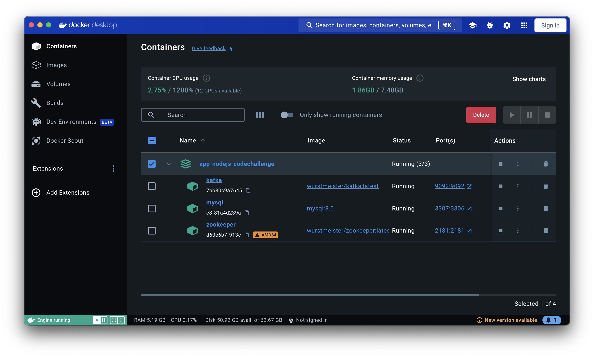

# Configuration Guide

## 1. Run the Dockerfile

To get a MySQL database and an Apache Kafka instance, run the Dockerfile. Make sure you have the `docker-compose.yml` file configured to start both services.



## 2. Connect to the Database and Run Migrations

Connect to the MySQL database and run the migrations located in the `/migrations` folder in date order to create the necessary tables and structure.

## 3. Create Topics in Kafka

Create the Kafka topics that we will use. In this case, they will be the following:

- `transaction-created`
- `transaction-approved`
- `transaction-rejected`

The commands to create the topics are:

```bash
docker exec -it <kafka-container-id> /opt/kafka/bin/kafka-topics.sh --create --zookeeper zookeeper:2181 --replication-factor 1 --partitions 1 --topic transaction-created
docker exec -it <kafka-container-id> /opt/kafka/bin/kafka-topics.sh --create --zookeeper zookeeper:2181 --replication-factor 1 --partitions 1 --topic transaction-approved
docker exec -it <kafka-container-id> /opt/kafka/bin/kafka-topics.sh --create --zookeeper zookeeper:2181 --replication-factor 1 --partitions 1 --topic transaction-rejected
```

## 4. Run Microservices

You will see two microservices:

- `fraud-detection-ms`
- `transactions-ms`

For `fraud-detection-ms`, follow these steps:

1. Go to the microservice folder.
2. Create a file in that location named `.env` with the following variables:

  ```env
  #Aplication
  PORT=3001
  X_APPLICATION_ID=fraud-detection-ms

  # Kafka
  KAFKA_BROKER=localhost:9092
  KAFKA_CLIENT_ID=anti-fraud-client
  KAFKA_GROUP_ID=anti-fraud-group
  ```

4. Install the dependencies with the command:
   ```bash
   npm i
   ```

5. Run the project:
   ```bash
   npm run start
   ```

For `transactions-ms`, follow these steps:

1. Go to the microservice folder.
2. Create a file in that location named .env with the following variables:

```env
# DB
DB_HOST=127.0.0.1
DB_PORT=3307
DB_USER=user
DB_PASSWORD=basededatos
DB_NAME=transactions
DB_SYNC=false

# Aplication
PORT=3000
X_APPLICATION_ID=transactions-ms

# Kafka
KAFKA_BROKER=localhost:9092
KAFKA_CLIENT_ID=transactions-ms
KAFKA_GROUP_ID=transactions-ms
```

4. Install the dependencies with the command:
   ```bash
   npm i
   ```

5. Run the project:
   ```bash
   npm run start
   ```

## 5. Access the Apollo Interface to Perform Queries and Mutations

Go to http://localhost:3000/graphql to access the Apollo interface.


## 6. Access the Documentation

Go to http://localhost:3000/api to access the application documentation.

